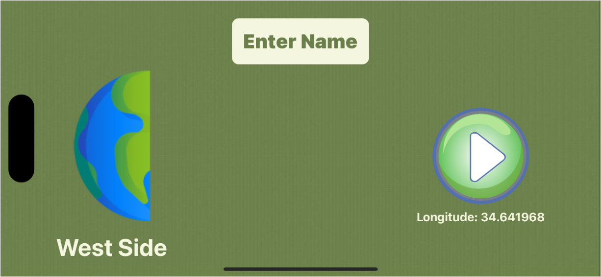
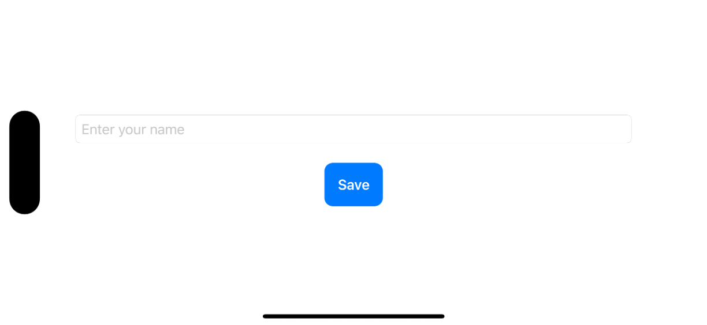
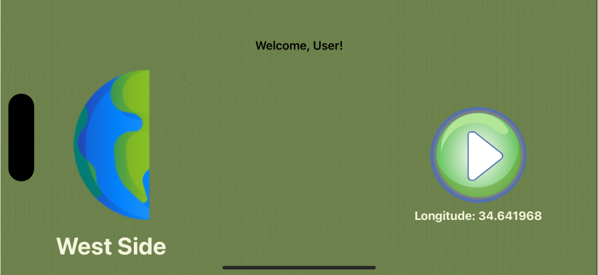
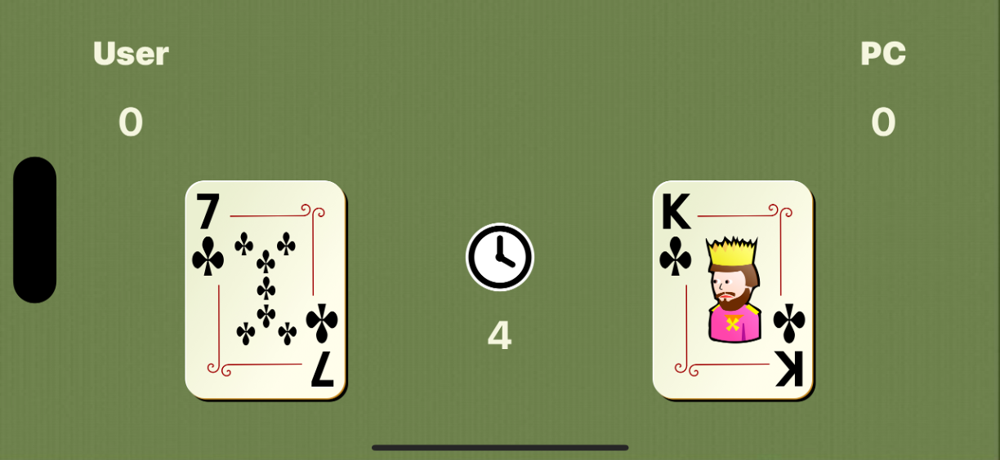
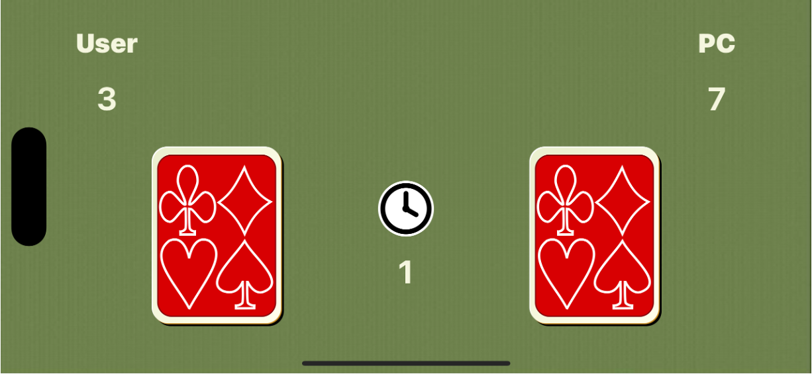
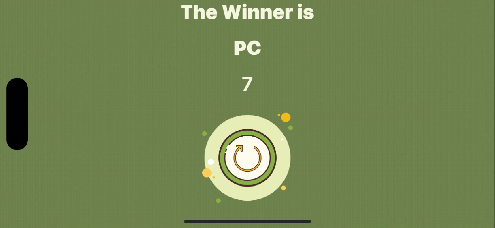

# War Card Game
The following is an iOS application built with Swift, offering a straightforward card game. 
It requires two participants: a user and a computer, who engage in a friendly competition by flipping cards and comparing their respective values. 
Points are awarded to the player with the higher card value in each round. 
The game proceeds for a total of ten rounds, culminating in the display of the final scores and the announcement of the victor.

## Functionality 
**The game:** 
- Allows user to enter her name, its save the name in the UserDefaults so it can retrieve it when entering the game again.
- Receives permission to the user's location to display the image that represents the location on Earth (east or west of the equator).
- Played automatically and after 10 rounds the winner is announced.

## Screens 
**Opening screen: request Location's permission**

**Opening screen: before entering name**

**Name screen: let the user enter their name**

**Opening screen: after entering name**

**Game screen**

**Score screen**

